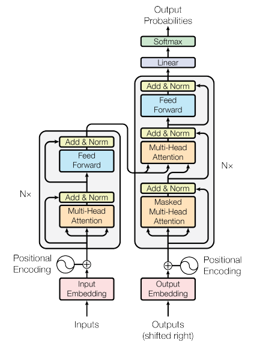
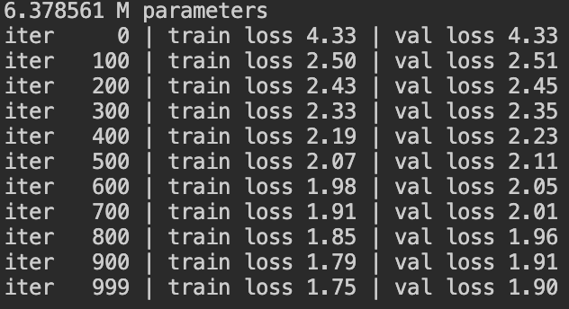

# iSpeakShakespeare

Decoder-only implementation of [Attention is All You Need](https://arxiv.org/abs/1706.03762) for Shakespearean language generation.



For training:
```
python train.py
```



Example Generation:
```
So sea command net far the withems hims in
I shee exch shiment's noldandege in nat's bity he
exoneswre as your sond he come and your that, swall
whave; hor'd hearb is to fearfulticced 'twoed;
Foor fend endys breas wourse fe be loinss.
Why havole wor to to with hus on.

ETHOS:
Be not do Madarract?

GLORINUS:
I ague ho lest, his soult.

Never:
For pappaciles tshiner ade fors tham to lonstsen,
Than herre. trand it altick noner, be beit.
Ti be; ither, your conter, we is spens,
And hast his besty bri
```

Inspired by [NanoGPT](https://github.com/karpathy/nanoGPT)

Data from [tinyshakespeare](https://raw.githubusercontent.com/karpathy/char-rnn/master/data/tinyshakespeare/input.txt)

